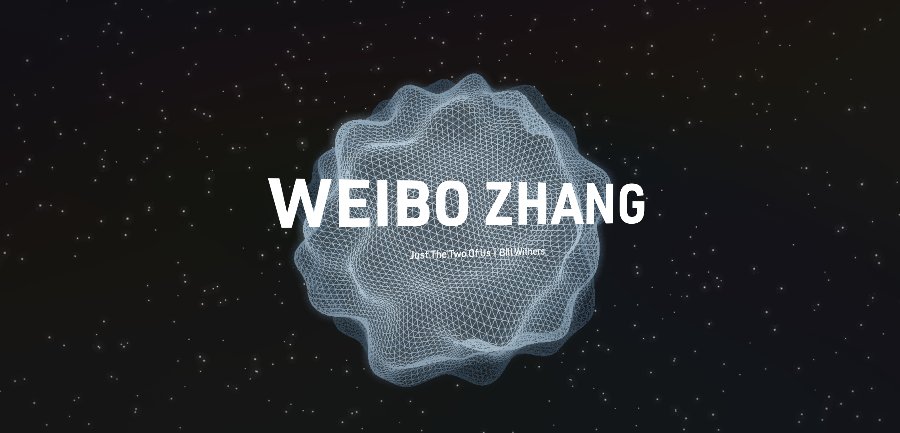
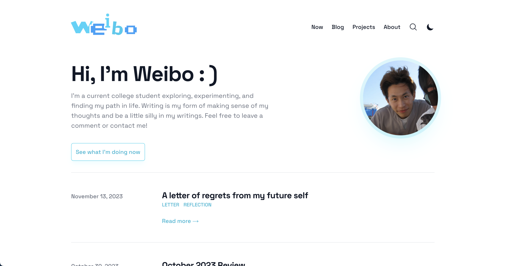

I completedly revamped my blog the last few days with the main goal of simplicity. I want to share some things I learned along the process.

## Astro

For the past few years, I been heavily leaning on NextJS for everything I build. I had only a hammer so I approached every project as a nail to be hammered. But after trying astro and building my blog on top of this framework, I see that I was really making it harder for myself by using NextJS for everything. Astro had built-in support for markdown files, meaning my markdown files automatically becomes a page route. I have only explored the basics of Astro but it is insane how little time it took me to redesign this site.

As a comparison, here were the previous two versions of my website:

## Making It Personal

The first version of my website was really personalized but I didn't quite like it because I couldn't share my learnings, thoughts as a blog would. The second version worked great as a blog but it felt heavily overcomplicated and complex that it deterred me from writing. With this third version, I want to be just be a space where I can share my hobbies, my writing, and what I'm doing now. Because that is what I genuinely care about.

## It's nice to have your own little estate on the Internet

I'm not the best writer at all and worse, reading my own blogs will make me cringe at it. But it's like journaling to me, and one day 5-10 years from now, I'll be able to look back at it and have a lil laugh.
