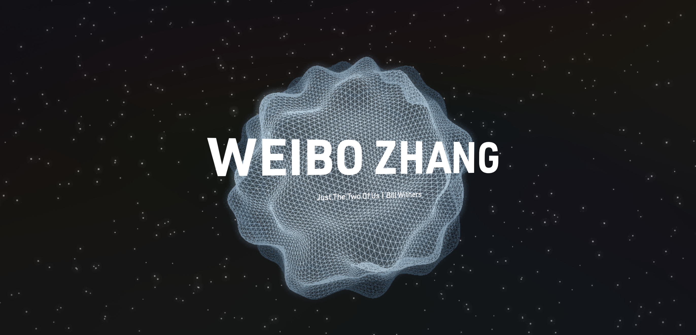

I completedly revamped my blog the last few days with the main goal of simplicity. I want to share some things I learned along the process.

## Astro

For the past few years, I been heavily leaning on NextJS for everything I build. I had only a hammer so I approached every project as a nail to be hammered. But after trying astro and building my blog on top of this framework, I see that I was really making it harder for myself by using NextJS for everything. Astro had built-in support for markdown files, meaning my markdown files automatically becomes a page route. I have only explored the basics of Astro but it is insane how little time it took me to completely re

As a comparison, here were the previous two versions of my website:

